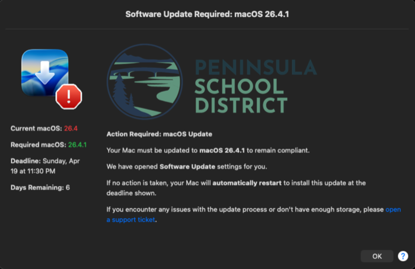

# SOFA + DDM Update Reminder

A Jamf-deployable macOS update reminder that combines SOFA's hardware-aware
release data with Apple's DDM enforcement state to show users the right
version at the right time.

<p align="center">
  
</p>

## What it does

- Fetches the SOFA feed from [macadmins.io](https://sofafeed.macadmins.io/v2/macos_data_feed.json)
  and picks the newest macOS release this specific hardware supports - including
  cross-version targeting (a macOS 15 machine whose hardware supports Tahoe gets
  pointed at Tahoe, not stuck on 15).
- Reads Apple's `SoftwareUpdateDDMStatePersistence.plist` to detect both
  scheduled MDM pushes and Blueprint enforcement. When DDM enforcement is
  active, the dialog switches to a more urgent layout with the deadline and
  days remaining.
- Opens System Settings > Software Update for the user and shows a
  SwiftDialog window with the required version, deadline, and a link to your
  support desk.
- Refuses to ever recommend a downgrade. If SOFA returns nonsense, the script
  exits clean with a `WARNING:` log line rather than showing the user a
  confusing dialog.

## Requirements

- macOS 14 or newer (tested on 14, 15, 26)
- [SwiftDialog](https://github.com/swiftDialog/swiftDialog) at
  `/usr/local/bin/dialog`
- Jamf Pro (or any MDM that can run a zsh script as root)
- A logo image URL reachable from your fleet

## Deploy

1. Paste the contents of `update_reminder.sh` into a Jamf script (or run from
   any other MDM that executes zsh as root).
2. Set the three customization points at the top of the script:
   - `corporateLogoURL` - PNG/JPG of your org logo (~300-500px wide, transparent
     PNG preferred). Loaded remotely, no local download needed.
   - `support_ticket_url` - the URL users land on when they click "open a
     support ticket" in the dialog.
   - `cautionIcon` - which system icon overlays the dialog during DDM
     enforcement. Default is `AlertStopIcon.icns` (red stop sign);
     `AlertCautionIcon.icns` is a yellow triangle.
3. Scope to the machines that should receive reminders. A daily policy works
   well; the script exits fast when the machine is already up to date, so
   there's no harm in running frequently.

### Testing locally

The script must run as root (it reads DDM state and launches the dialog in the
console user's context):

```
sudo ./update_reminder.sh
```

Set `demoMode="true"` at the top of the script to force the dialog to appear
even on up-to-date hardware - useful when iterating on the UI.

## How targeting works

Two tested zsh functions carry the targeting logic, both extracted into
`sofa_functions.sh` for unit testing:

- `find_target_for_device <boardID> <sofaData>` - walks SOFA's `OSVersions`
  newest-to-oldest. For each OS, finds the highest release this hardware
  supports. Universal releases (no `SupportedDevices` listed in SOFA) fall back
  to the OS family's `Latest.SupportedDevices`. Device-specific releases (like
  a Neo-only build) only match when the board ID is in their explicit list.
- `find_enforced_update <ddmEntries> <currentVersion> <boardID> <sofaData>` -
  filters DDM declarations by "already installed?" and "available for this
  hardware per SOFA?", then picks the highest version. Earliest deadline is
  the tiebreaker for declarations of the same version. This prevents a stale
  older enforcement from beating a newly-arrived newer one in the same plist.

A third function, `is_version_for_device`, is shared by both.

## Testing

Run the test suite:

```
./test_sofa_functions.sh
```

It fetches the live SOFA feed and runs 43 tests against both synthetic
fixtures and real data. Periodically running this is the early-warning system
for SOFA schema changes - if the tests start failing on real data, SOFA has
drifted and the targeting logic may need adjustment.

## Credits

- [Dan Snelson's DDM macOS Update Reminder](https://snelson.us/2025/03/ddm-macos-update-reminder-0-0-1/)
  was the original inspiration for this script. Several UI patterns
  (SwiftDialog layout, DDM overlay, help message placement) were borrowed
  from his work.
- [SOFA](https://sofa.macadmins.io/) by the MacAdmins community provides the
  authoritative feed of macOS release metadata and hardware compatibility.
- [SwiftDialog](https://github.com/swiftDialog/swiftDialog) by Bart Reardon for
  the dialog rendering.

## License

MIT - see [LICENSE](LICENSE).
