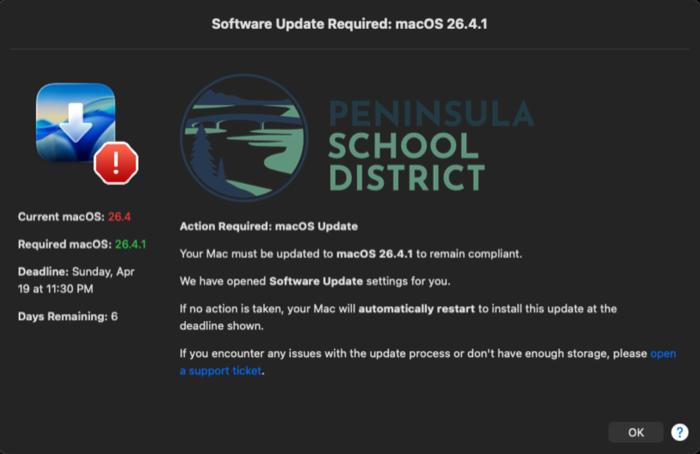
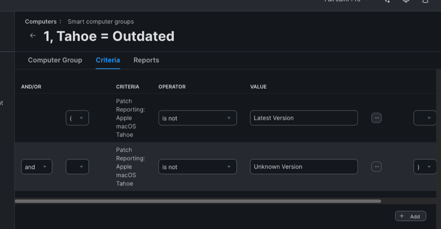

# SOFA + DDM Update Reminder

A Jamf-deployable macOS update reminder. It uses SOFA's release data to work
out the newest macOS each Mac's hardware supports, reads Apple's DDM
enforcement state, and shows a swiftDialog reminder with a button that opens
Software Update.

<p align="center">
  
</p>

## What it does

- **DDM enforcement.** When a DDM declaration (a scheduled MDM push or a
  Blueprint "enforce latest within N days" policy) is ordering an update, the
  dialog names the enforced version, the deadline and the days remaining. It
  never mentions a release newer than the one being enforced.
- **No enforcement.** The script nudges toward the newest release this
  hardware supports, but only after that release has cleared a release hold
  (2 days by default) and Software Update on the Mac is actually offering it.
  If Software Update is still deferring a release, the script shows nothing.
- **Hardware-aware targeting.** SOFA's `SupportedDevices` drives the
  recommendation per board ID, so a Neo-only release isn't offered to other
  hardware, and a Tahoe-capable Mac still on Sequoia is pointed at Tahoe.
- **Version pin.** Jamf script parameter 4 caps the recommendation at a major
  version (for example `26` while macOS 27 is held back). A Mac already on a
  newer major than the pin is capped at its own major instead, so it still
  gets that major's updates.
- **Timing.** The dialog waits while a meeting or presentation is on screen
  (up to 75 minutes), and opens Software Update only when the user clicks
  **Open Software Update**. **Later** closes the dialog, and an unanswered
  dialog closes itself after 4 hours so the next day's reminder can run.
  Choosing Install Tonight in Software Update doesn't stop the reminder.
  Install Tonight isn't reliable on Macs with a Software Update deferral (a
  queued 27.0.1 never installed on a test Mac), so the reminder keeps going
  until the Mac is updated.

## Requirements

- macOS 14 or newer (tested on 14, 15 and 26)
- [swiftDialog](https://github.com/swiftDialog/swiftDialog) at
  `/usr/local/bin/dialog`
- Jamf Pro, or any MDM that can run a zsh script as root
- A logo image URL reachable from your fleet

## Deploy

1. Paste the contents of `update_reminder.sh` into a Jamf script.
2. Set the customization points in the CONFIGURATION block at the top of the
   script (see Configuration below). At minimum: `corporateLogoURL` and
   `support_ticket_url`.
3. Label script parameter 4 "Maximum major version". In the policy, set it to
   the newest major you want users moved to (for example `26`), or leave it
   blank to always recommend the newest supported release.
4. Scope to a smart computer group built on patch reporting for the current
   macOS target. Example, "1, Tahoe = Outdated":

   <p align="center">
     
   </p>

   Criteria: `Patch Reporting: Apple macOS Tahoe is not "Latest Version"`
   **AND** `Patch Reporting: Apple macOS Tahoe is not "Unknown Version"`.
   This pulls in every Mac Jamf knows is behind on Tahoe and leaves out Macs
   whose patch status isn't known yet (new enrollments, offline Macs). The
   script does the per-device targeting inside that group. A once-a-day policy
   works well. The script exits in about a second when the Mac is current.

## Configuration

All settings are plain variables in the CONFIGURATION block.

| Variable | Default | Purpose |
| --- | --- | --- |
| `corporateLogoURL` | PSD logo URL | Logo shown in the dialog, loaded remotely |
| `support_ticket_url` | Freshservice URL | Link behind "open a support ticket" |
| `cautionIcon` | `AlertStopIcon.icns` | Overlay icon during DDM enforcement (`AlertCautionIcon.icns` is the yellow triangle) |
| `demoMode` | `false` | `true` shows the dialog on any Mac, for UI testing |
| `releaseHoldDays` | `2` | Days a new release is held before a no-enforcement nudge recommends it |
| `softwareUpdateListSeconds` | `90` | Time limit for `softwareupdate --list` |
| `reminderLogPath` | `/var/log/update_reminder.log` | Log written by the presenter (meeting waits, button clicks) |
| `reminderPidPath` | `/var/run/update_reminder.pid` | Lock that stops a second reminder while one is waiting or on screen |
| `meetingAssertionApps` | Teams, Zoom, Webex, Slide Show, Keynote, Blink Wake Lock | Apps or assertion names that count as a meeting or presentation |
| `meetingCheckSeconds` | `300` | Seconds between meeting checks |
| `meetingMaxChecks` | `15` | Checks before giving up (300 x 15 = 75 minutes) |
| `dialogTimeoutSeconds` | `14400` | Seconds before an unanswered dialog closes itself (4 hours) |
| `softwareUpdateURL` | Software Update pane | Opened when the user clicks **Open Software Update** |

## How the decision is made

1. Fetch SOFA (3 attempts) and find the newest release for this board ID,
   capped by the version pin. Exit if the Mac already has it.
2. Read `/var/db/softwareupdate/SoftwareUpdateDDMStatePersistence.plist` for
   enforcement declarations that apply to this Mac and this hardware.
3. With an enforcement, remind about the enforced version. Without one, check
   the release hold against SOFA's `ReleaseDate`, then check that
   `softwareupdate --list` offers that exact version. Either check failing
   means no dialog today.
4. Hand the dialog to a background presenter and exit, so the Jamf policy
   finishes in seconds. The presenter waits out meetings, then shows the
   dialog. If a meeting outlasts the wait, a no-enforcement nudge is skipped
   for the day and a DDM reminder is shown anyway. Within 24 hours of a DDM
   deadline the meeting check is skipped.

The release hold runs `releaseHoldDays` plus one day from SOFA's
`ReleaseDate`. SOFA dates are midnight UTC and Apple releases during the US
day, so the extra day keeps the reminder behind Software Update's own
deferral.

## Logs

The Jamf policy log shows every decision the main script makes. The
presenter writes its own lines (meeting checks, button clicks, timeouts,
skips) to
`/var/log/update_reminder.log` on the Mac.

## Testing

Two suites, both run from the repo folder:

```
./test_sofa_functions.sh
./test_update_reminder.sh
```

`test_sofa_functions.sh` unit-tests the decision functions in
`sofa_functions.sh` against fixtures (captured `softwareupdate` and `pmset`
output in `fixtures/`) and the live SOFA feed. It also checks that
every shared function in `update_reminder.sh` is byte-identical to its copy in
`sofa_functions.sh`, since the deployed script has to be self-contained. If the
live-feed tests start failing, SOFA's schema has probably changed.

`test_update_reminder.sh` runs a copy of the real script end to end the way
Jamf runs it (SIGPIPE ignored, no stdin, behind a watchdog), with stubbed
system commands. It covers the release hold, the Software Update check, the
DDM dialog, reminders after Install Tonight, meeting waits, the button
results, the run lock, and that the script returns while the presenter is
still waiting.

To try the script on a Mac:

```
sudo zsh ./update_reminder.sh / "$(hostname)" "$(whoami)" 26
```

The last argument is parameter 4. Set `demoMode="true"` to see the dialog on a
Mac that is already current.

## Limitations

- Focus and Do Not Disturb aren't detected. Reading them needs Full Disk
  Access on macOS 26 and later.
- The Keynote entry in `meetingAssertionApps` hasn't been checked against a
  real Keynote presentation.

## Credits

- [Dan Snelson's DDM macOS Update Reminder](https://snelson.us/2025/03/ddm-macos-update-reminder-0-0-1/)
  was the original inspiration for this script. The swiftDialog layout, DDM
  overlay and help message placement came from his work, as did the meeting
  check.
- [SOFA](https://sofa.macadmins.io/) by the MacAdmins community provides the
  macOS release and hardware compatibility feed.
- [swiftDialog](https://github.com/swiftDialog/swiftDialog) by Bart Reardon
  renders the dialog.

## License

MIT - see [LICENSE](LICENSE).
